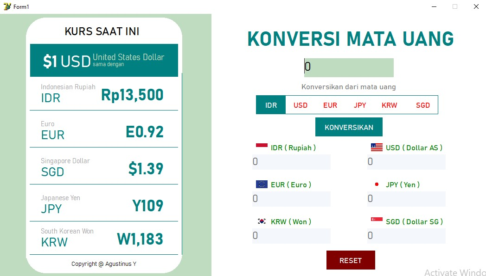
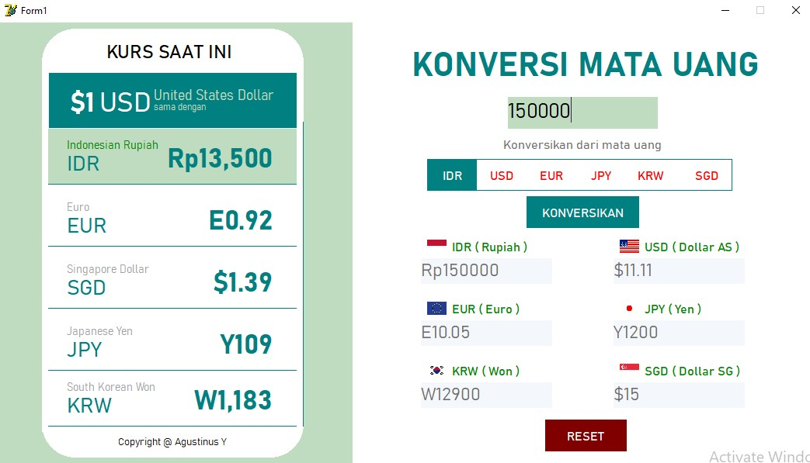

# Delphi Konversi Mata Uang

Konversi mata uang menggunakan program Delphi

Tampilan Awal setelah dijalankan

Tampilan setelah dijalankan

## Komponen

- Button
- Text Field
- Label
- Shapes
- Picture

### Fitur

1. Menggunakan Konsep Aritmatika
2. Konversi dari ke 6 mata uang
3. Smartphone Screen untuk menampilkan detail nilai mata uang
4. Saat ini Nilai mata uang belum dapat terupdate otomatis

#### Kritik dan saran dipersilahkan :D
